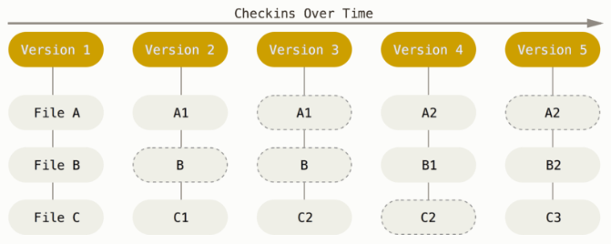
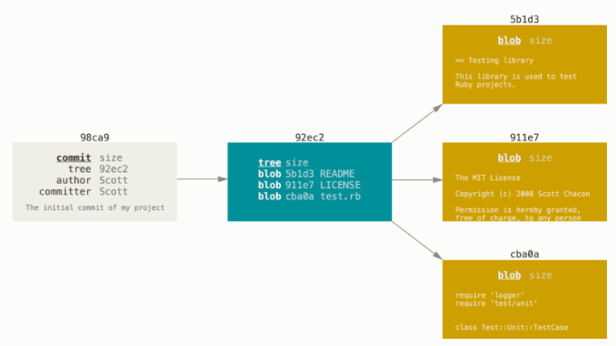
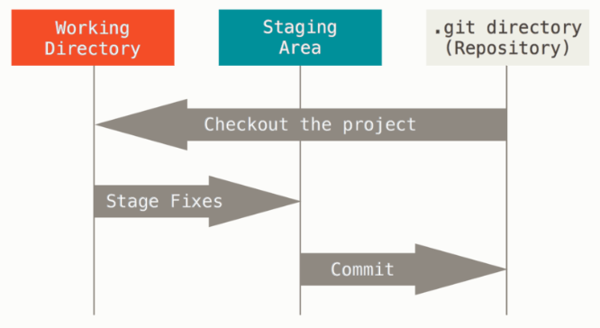
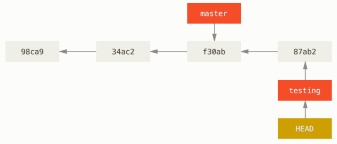

# git-cheatsheet

-  [How Git Works](https://github.com/fprotopapa/git-cheatsheet/blob/main/README.md#how-git-works)
-  [Installation](https://github.com/fprotopapa/git-cheatsheet/blob/main/README.md#installation)
-  [Create Repository](https://github.com/fprotopapa/git-cheatsheet/blob/main/README.md#create-repository)
-  [Configuration](https://github.com/fprotopapa/git-cheatsheet/blob/main/README.md#configuration)
-  [Staging And Commiting](https://github.com/fprotopapa/git-cheatsheet/blob/main/README.md#staging-and-commiting)
-  [Git Diff](https://github.com/fprotopapa/git-cheatsheet/blob/main/README.md#git-diff)
-  [Literature](https://github.com/fprotopapa/git-cheatsheet/blob/main/README.md#literature)

## How Git Works

### Storing Information

The major difference between Git and any other VCS (Subversion and friends included) is the way Git thinks about its data. Conceptually, most other systems store information as a list of file-based changes. These other systems (CVS, Subversion, Perforce, Bazaar, and so on) think of the information they store as a set of files and the changes made to each file over time (this is commonly described as delta-based version control). Git doesn’t think of or store its data this way. Instead, Git thinks of its data more like a series of snapshots of a miniature filesystem. With Git, every time you commit, or save the state of your project, Git basically takes a picture of what all your files look like at that moment and stores a reference to that snapshot. To be efficient, if files have not changed, Git doesn’t store the file again, just a link to the previous identical file it has already stored. Git thinks about its data more like a stream of snapshots.



When you make a commit, Git stores a commit object that contains a pointer to the snapshot of the content you staged. This object also contains the author’s name and email address, the message that you typed, and pointers to the commit or commits that directly came before this commit (its parent or parents): zero parents for the initial commit, one parent for a normal commit, and multiple parents for a commit that results from a merge of two or more branches.

When you create the commit by running git commit, Git checksums each subdirectory (in this case, just the root project directory) and stores them as a tree object in the Git repository. Git then creates a commit object that has the metadata and a pointer to the root project tree so it can re-create that snapshot when needed.



How does Git reduce needed space when creating snapshots. Wouldn’t it be nice if Git could store nearly identical files as deltas from one full object?

It turns out that it can. The initial format in which Git saves objects on disk is called a “loose” object format. However, occasionally Git packs up several of these objects into a single binary file called a “packfile” in order to save space and be more efficient. Git does this if you have too many loose objects around, if you run the git gc command manually, or if you push to a remote server.

### Decentralized

Most operations in Git need only local files and resources to operate — generally no information is needed from another computer on your network. If you’re used to a CVCS where most operations have that network latency overhead, this aspect of Git will make you think that the gods of speed have blessed Git with unworldly powers. Because you have the entire history of the project right there on your local disk, most operations seem almost instantaneous.

### Integrity

Everything in Git is checksummed before it is stored and is then referred to by that checksum. This means it’s impossible to change the contents of any file or directory without Git knowing about it. This functionality is built into Git at the lowest levels and is integral to its philosophy. You can’t lose information in transit or get file corruption without Git being able to detect it. The mechanism that Git uses for this checksumming is called a SHA-1 hash. This is a 40-character string composed of hexadecimal characters (0–9 and a–f) and calculated based on the contents of a file or directory structure in Git.

### The Three States
Pay attention now — here is the main thing to remember about Git if you want the rest of your learning process to go smoothly. Git has three main states that your files can reside in: modified, staged, and committed:

- Modified means that you have changed the file but have not committed it to your database yet.

- Staged means that you have marked a modified file in its current version to go into your next commit snapshot.

- Committed means that the data is safely stored in your local database.

This leads us to the three main sections of a Git project: the working tree, the staging area, and the Git directory.



### Branching

The way Git branches is incredibly lightweight, making branching operations nearly instantaneous, and switching back and forth between branches generally just as fast. Unlike many other VCSs, Git encourages workflows that branch and merge often, even multiple times in a day.



Source: [Git Book](https://git-scm.com/book/en/v2/Getting-Started-What-is-Git%3F).

## Installation

For all subpackages:
```
sudo apt install git-all
```

With small footprint:
```
sudo apt install git
```

## Create Repository

```
git init <folder>

git clone <url, e.g, git SSH: git@HOSTNAME:USERNAME/REPONAME.git>

Add --bare to git init/clone to create a remote repo.
Remote's name should end with '.git'
```

## Configuration

- Local: /.git/config – Repository-specific settings. Flag: --local
- Global: /.gitconfig – User-specific settings. Flag: --global
- System: /etc/gitconfig – System-wide settings. Flag: --system

```
Add remote URL to local config:
git remote add <remote_name> <remote_repo_url>

git config --global user.name <name>
git config --global user.email <email>

Create command alias:
git config --global alias.ci commit
```
[Customize Git](https://git-scm.com/book/en/v2/Customizing-Git-Git-Configuration)

## Staging And Commiting

Staging:
```
git add <file> // Add file
git add <folder> // Add folder
git add -p // Interactive staging
```

Commit:
```
git commit // Commit staged snapshot
git commit -a // Commit a snapshot of all changes in the working directory (only tracked files)
git commit -m "Commit Message" // Immediately creates a commit with a passed commit message
git commit -am "Commit Message" 

git commit --amend // Modify the last commit. Staged changes will be added to the previous commit & commit message can be edited.
```

## Git Diff

```
git diff // Compare working directory with staged area
git diff --staged // Compare Staging area with last commit
git diff ./path/to/file // Compares HEAD to specific file
git diff 957fbc92b123030c389bf8b4b874522bdf2db72c ce489262a1ee34340440e55a0b99ea6918e19e7a // Comparing commits
```

Diff output:
```
diff --git a/somefile.txt b/somefile.txt // file
index 245dde3..3925e28 100644 // git meta data
--- a/somefile.txt // old version of file and legend
+++ b/somefile.txt // new version of file and legend
@@ -1,9 +1,9 @@ // Begin of chunk, from line 1 extracted 9 lines from file a and extracted 9 lines (starting from line 1) from file b
 a
-b // File a
+bb // File b
 c
-d
+dd
 e
-f
-g
+ff
+gg
 h
 k
```

Changing diff output:
```
git diff --color-words // Show difference on same line
git diff --diff-highlight // Highlight changes
```

Diff branches:
```
git diff branch1..branch2 // Shows differences in branch1 and branch2 (.. and space work the same)
git diff branch1...branch2 // Shows only differences in branch2, changes based of the merge-base (also known as most common ancestor)
git diff main new_branch ./diff_test.txt // Compare file between branches
```

## Literature

- https://www.atlassian.com/git/tutorials
- https://git-scm.com/doc
